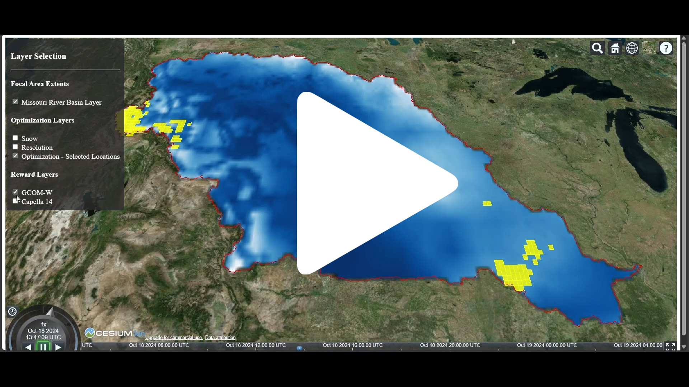

# Snow Observing Systems (SOS) Visualizer

This project delivers a 3D visualization web application that receives and processes messages sent through the Novel Observing Strategies Testbed (NOS-T) event broker.

<a href="https://youtu.be/zKBMltZmC8g" target="_blank">
  
</a>

> **Note:** Click the image above with the white play icon to watch the demonstration.

## Table of Contents

- [Preparation](#preparation)
- [Run Application](#run-application)
- [Project Structure](#project-structure)
- [Dependencies](#dependencies)
<!-- - [Contributing](#contributing)
- [License](#license) -->

## Preparation

- Install Node.JS on Linux:

```bash
sudo apt update && sudo apt install nodejs && sudo apt install npm
```

For Windows and macOS instructions, refer to [Download Node.js](https://nodejs.org/en/download/package-manager).

- Confirm installation:

```bash
node -v
npm -v
```

> **Note:** You will see the installed version number of node and npm if the installation was successful.

- Clone GitHub repo:

```bash
git clone git@github.com:emmanuelgonz/nost_sos_visualization.git
```

- Navigate to cloned repo:

```bash
cd nost_sos_visualization
```

- Install dependencies:

```bash
npm install
```

- Create Cesium account:

Sign up for a free Cesium ion account [here](https://ion.cesium.com/signup). Then, copy your access token [here](https://ion.cesium.com/tokens?).

- Create env.js file

```bash
touch env.js
```

To the file, add the contents: 

```
var HOST="nost.smce.nasa.gov"
var RABBITMQ_PORT=15670
var KEYCLOAK_PORT=8443
var CLIENT_ID=<request from NOS-T administrators>
var CLIENT_SECRET=<request from NOS-T administrators>
var USERNAME=<request from NOS-T administrators>
var PASSWORD=<request from NOS-T administrators>
var TOKEN=<Cesium access token>
```

## Run Application

Start application:

```bash
node server.js
```

## Project Structure

- server.js: Main server file.
- env.js: Environment configuration.
- js/: JavaScript modules.
- media/: Media assets.
- public/: Publicly accessible files.
- spatial/: GeoJSON files for spatial data.

## Dependencies

The project relies on the following dependencies: 

- [Cesium](https://cesium.com/platform/cesiumjs/)
- [Express](https://expressjs.com/)